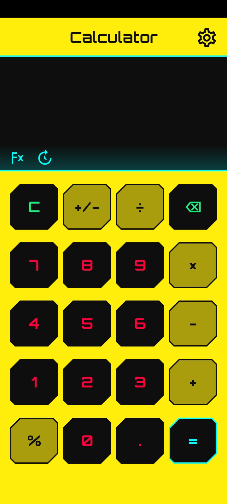

# CalculatorApp
Cyberpunk Theme Calculator

## 📥 Download

✨ Features

<li> Cyberpunk neon UI </li>

Dark Mode + Light Mode

Smooth button animations

Scientific calculator mode

Smart input handling

Auto-save display & history

Adjustable text size

Built in Android Studio (Java)

## 📸 Screenshots

  
  

